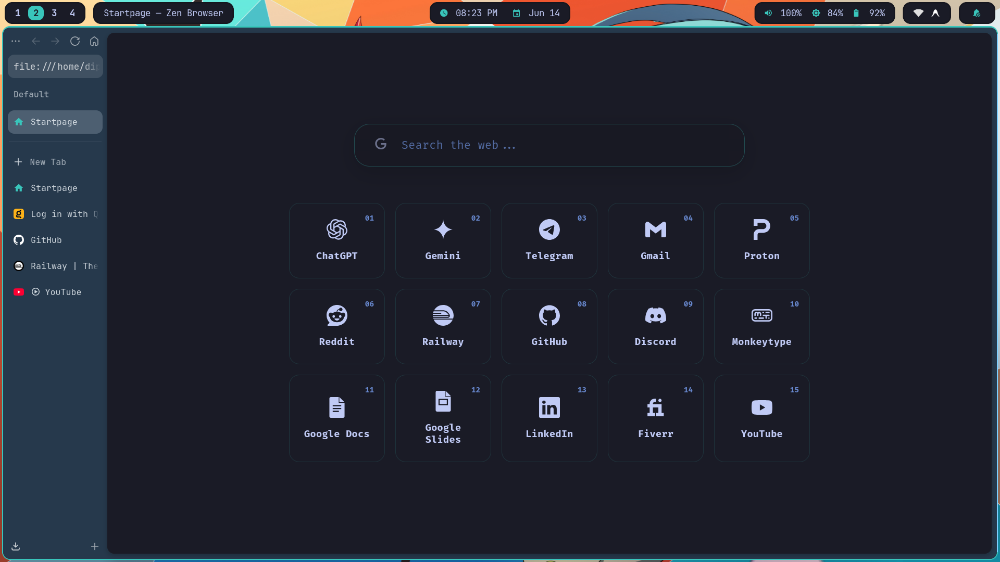

# Miku Startpage

A clean, fast, and minimalist custom homepage. It is designed to maintain focus, completely free of ads and clutter.

## Features

- **Flat Design:** A pure dark mode layout with perfectly matching colors and smooth fade-in animations.
- **Search Engine Switching:** Click the icon inside the search bar to switch between Google, DuckDuckGo, Bing, Startpage, Yandex, Brave, Ecosia, and Kagi. The selection is saved automatically.
- **Instant Keyboard Focus:** Press the `Escape` key from anywhere on the page to jump straight to the search bar and start typing. 
- **Numbered Bookmark Shortcuts:** Every website in the grid has a small number. Type that exact number into the search bar and hit `Enter` to instantly launch the website.
- **Offline Capable:** Built purely with HTML, CSS, and JavaScript. All icons and logic are saved locally.

## Usage

Simply open the `index.html` file in a web browser. The browser's "Homepage" or "New Tab" setting can also be configured to point to this file so it opens automatically.
